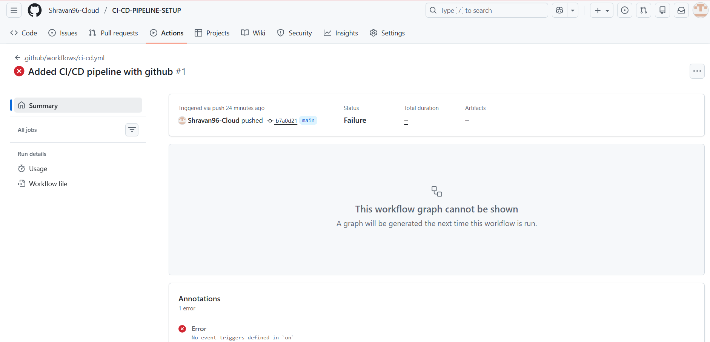
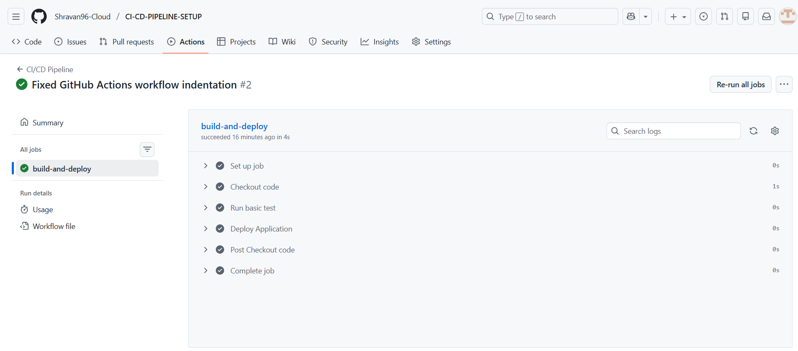

# CI/CD Pipeline Setup

## Objective
To build a CI/CD pipeline using GitHub Actions.

## Tools Used
- GitHub
- GitHub Actions
- Visual Studio Code
- HTML

## CI/CD Workflow Explanation
1. Developer pushes code to the main branch.
2. GitHub Actions workflow is triggered automatically.
3. The pipeline checks out the source code.
4. Basic test step is executed.
5. Application deployment step runs automatically.

## Pipeline Execution Evidence

### Initial Failure
The pipeline initially failed due to a workflow configuration issue.  
The error was analyzed and the configuration was corrected.

### Successful Execution
After fixing the issue, the pipeline ran successfully and completed all stages.

## Conclusion
This project demonstrates a working CI/CD pipeline that automates the deployment process using GitHub Actions.
